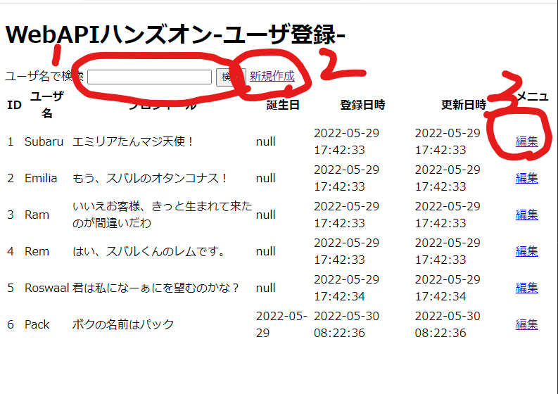
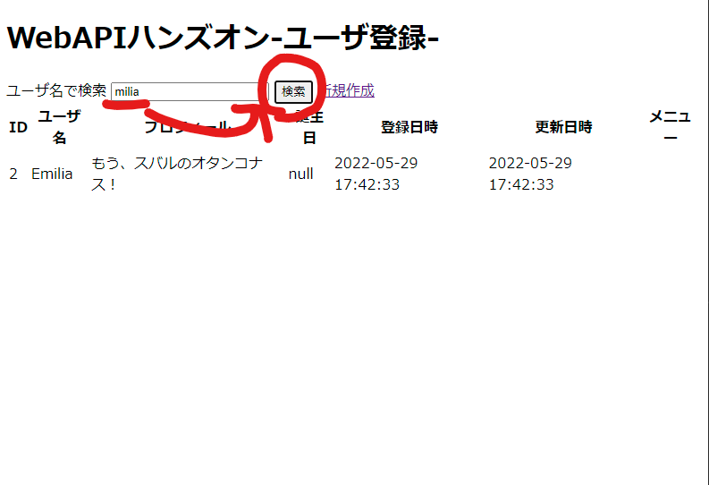
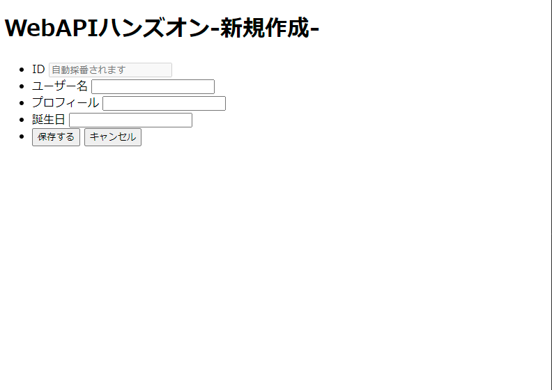
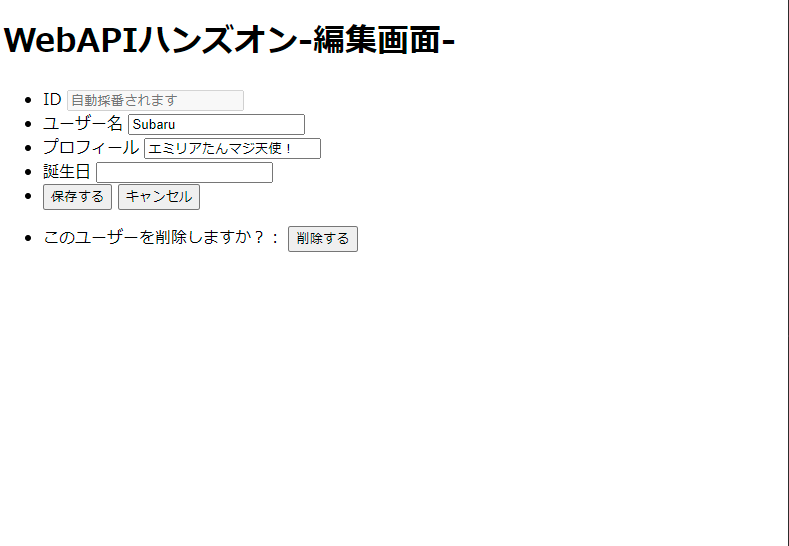

# 04_add_client_app

- 『HTML のフォームから API を実行しよう』をやってみる
  - refer Utube : https://www.youtube.com/watch?v=pRoIxvhFbow&list=PLX8Rsrpnn3IVW5P1H1s_AOP0EEyMyiRDA&index=5
  - API を実行するクライアントアプリを追加する
  - サーバとクライアントを独立して変更したい。しかし、CORS 問題を解決できてないので、同一サーバで実行
  - 将来の機能も含めてクライアントアプリを準備
    - `app/public/index.html` をport番号3000で起動する

## クライアントアプリのサービス
- `app/app.js` でRESTサービスと共存して起動する
- クライアントアプリの配信部分
```JavaScript
const express = require('express')
const path = require('path')
const app = express()
//
// publicディレクトリを静的ファイルのルートディレクトリとして設定
app.use(express.static(path.join(__dirname, 'public')));
//
// define port, start listen
const port = process.env.PORT || 3000;
app.listen(port)
console.log("Listen on port : " + port)
//
```

## クライアントアプリ

- ユーザリストから、ユーザーの絞込み（１）、ユーザーの新規作成（２）、ユーザ情報の編集（３）を行えるクライアントアプリ

- トップページ：RESTサーバから取得したユーザ一覧を表示


### １．ユーザの絞込み
- ユーザ名の一部に文字で検索して、表示



### ２．ユーザー新規作成
- 「新規作成」リンクから、新規ユーザを登録できる


### ３．ユーザー情報の編集
- ユーザーリストの「編集」リンクより、既存ユーザの情報を編集できる



